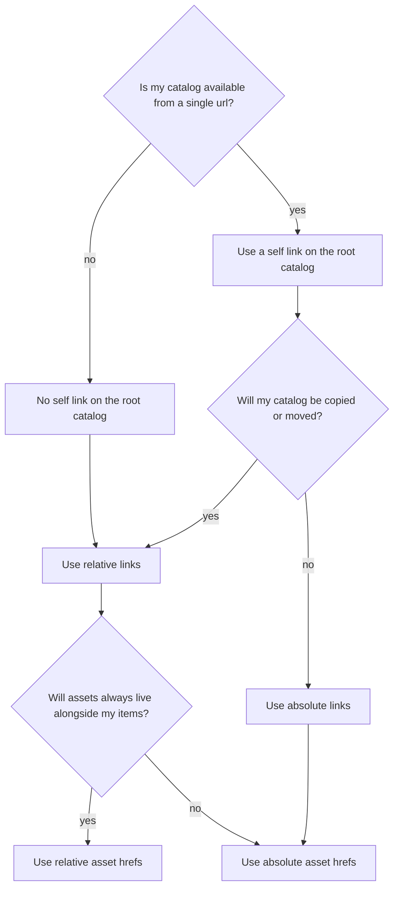

# STAC Catalog and Collection Best Practices

## Table of Contents

- [Static and Dynamic Catalogs](#static-and-dynamic-catalogs)
  - [Static Catalogs](#static-catalogs)
  - [Dynamic Catalogs](#dynamic-catalogs)
- [Catalog Layout](#catalog-layout)
  - [Dynamic Catalog Layout](#dynamic-catalog-layout)
  - [Mixing STAC Versions](#mixing-stac-versions)
- [Using Summaries in Collections](#using-summaries-in-collections)
- [Use of links](#use-of-links)
- [Using Relation Types](#using-relation-types)
- [Versioning for Catalogs](#versioning-for-catalogs)
- [Static to Dynamic best practices](#static-to-dynamic-best-practices)
  - [Ingestion and links](#ingestion-and-links)
  - [Keep catalogs in sync with cloud notification and queue services](#keep-catalogs-in-sync-with-cloud-notification-and-queue-services)

_Note: This section uses the term 'Catalog' (with an uppercase C) to refer to the JSON entity specified in the
[Catalog spec](https://github.com/radiantearth/stac-spec/blob/master/catalog-spec/catalog-spec.md), and 'catalog' (with a lowercase c) to refer to any full STAC implementation,
which can be any mix of Catalogs, Collections, and Items._

## Static and Dynamic Catalogs

As mentioned in the main [overview](overview.md), there are two main types of catalogs - static
and dynamic. This section explains each of them in more depth and shares some best practices on each.

### Static Catalogs

A static catalog is an implementation of the STAC specification that does not respond dynamically to requests. It is simply
a set of files on a web server that link to one another in a way that can be crawled, often stored in an cloud storage
service like [Amazon S3](https://aws.amazon.com/s3/), [Azure Storage](https://azure.microsoft.com/en-us/services/storage/) and
[Google Cloud Storage](https://cloud.google.com/storage/). But any http server could expose a static catalog as files.
The core JSON documents and link structures are encoded in the file, and work as long as things are structured properly.
A static catalog can only really be crawled by search engines and active catalogs; it can not respond to queries.
But it is incredibly reliable, as there are no moving parts, no clusters or databases to maintain.
The goal of STAC is to expose as much asset metadata online as possible, so the static catalog offers a very low
barrier to entry for anyone with geospatial assets to make their data searchable.

Static catalogs tend to make extensive use of _sub-catalogs_ to organize their Items into sensible browsing structures,
as they can only have a single representation of their catalog, since the static nature means the structure is baked in.
While it is up to the implementor to organize the catalog, it is recommended to arrange it in a way that would make sense
for a human to browse a set of STAC Items in an intuitive matter.

Users indicate their intent for a file to be parsed as a Collection or Catalog using the required `type` field on
each entity. For Collections, this field must have the value `Collection`, while for Catalogs, it must have the
value `Catalog`. Additionally, we recommend for static STACs indicate contents using the filenames `catalog.json`
or `collection.json` to distinguish the Catalog from other JSON type files. In order to support multiple catalogs, the recommended practice
is to place the Catalog file in namespaces "directories". For example:

- current/catalog.json
- archive/catalog.json

### Dynamic Catalogs

A dynamic catalog is implemented in software as an HTTP-based API, following the same specified JSON structure for Items, Catalogs
and Collections. Its structure and responses are usually generated dynamically, instead of relying on a set of
already defined files. But the result is the same, enabling the same discovery from people browsing and search engines crawling.
It generally indexes data for efficient responses, and aims to be easy for existing APIs to implement as a more standard interface
for clients to consume. A dynamic catalog will sometimes be populated by a static catalog, or at least may have a 'backup' of its
fields stored as a cached static catalog.

Dynamic catalogs often also implement the [STAC API](https://github.com/radiantearth/stac-api-spec/) specification, that
responds to search queries (like "give me all imagery in Oahu gathered on January 15, 2017"). But they are not required to. One
can have a dynamic service that only implements the core STAC specification, and is crawled by STAC API implementations that
provide 'search'. For example a Content Management Service like Drupal or an open data catalog like CKAN could choose to expose
its content as linked STAC Items by implementing a dynamic catalog.

One benefit of a dynamic catalog is that it can generate various 'views' of the catalog, exposing the same Items in
different sub-catalog organization structures. For example one catalog could divide sub-catalogs by date and another by
providers, and users could browse down to both. The leaf Items should just be linked to in a single canonical location
(or at least use a `rel` link that indicates the location of the canonical one).

## Catalog Layout

Creating a catalog involves a number of decisions as to what folder structure to use to represent sub-catalogs, Items
and assets, and how to name them. The specification leaves this totally open, and you can link things as you want. But
it is recommended to be thoughtful about the organization of sub-catalogs, putting them into a structure that a person
might reasonably browse (since they likely will with [STAC on the Web](./best-practices-web.md#stac-on-the-web) recommendations). For example
start with location, like a normal grid (path+row in Landsat) or administrative boundaries (country -> state-level) and
then year, month, day. Or do the opposite - date and then location. Making a huge unordered list is technically allowed,
but not helpful for discovery of data. Thus it is generally considered a best practice to make use of sub-catalogs to
keep the size of each sub-catalog under a megabyte. If your sub-catalog lists tens of thousands of child items then you
should consider an additional way to break it up.

We encourage people to explore new structures of linking data, but the following list is what a number of implementors
ended up doing. Following these recommendations makes for more legible catalogs, and many tools operate more efficiently
if you follow these recommendations.

1. Root documents (Catalogs / Collections) should be at the root of a directory tree containing the static catalog.
2. Catalogs should be named `catalog.json` and Collections should be named `collection.json`.
3. Items should be named `<id>.json`.
4. Sub-Catalogs or sub-Collections should be stored in subdirectories of their parent
   (and only 1 subdirectory deeper than a document's parent, e.g. `.../sample/sub1/catalog.json`).
5. Items should be stored in subdirectories of their parent Catalog or Collection
   if there are usually [sidecar files](https://en.wikipedia.org/wiki/Sidecar_file) stored alongside the Item.
   This means that each Item and its assets are contained in a unique subdirectory unless this would regularly lead to a single Item in a directory.
6. Limit the number of Items in a Catalog or Collection, grouping / partitioning as relevant to the dataset.
7. Use structural elements (Catalog and Collection) consistently across each 'level' of your hierarchy.
   For example, if levels 2 and 4 of the hierarchy only contain Collections,
   don't add a Catalog at levels 2 and 4.

One further recommendation to help tools is to always include the 'title' field when including a link, especially in the
`item`, `child`, `parent` and `root` links, even if it repeats several times. This should be the same as the 'title' in the
link destination. Having this enables clients to display a nice human readable name of the link without having to open the
link destination.

### Dynamic Catalog Layout

While these recommendations were primarily written for [static catalogs](#static-catalogs), they apply
equally well to [dynamic catalogs](#dynamic-catalogs). Subdirectories of course would just be URL paths
generated dynamically, but the structure would be the same as is recommended.

One benefit of a dynamic catalog is that it can generate various 'views' of the catalog, exposing the same Items in
different sub-catalog organization structures. For example one catalog could divide sub-catalogs by date and another
by providers, and users could browse down to both. The leaf Items should just be linked to in a single canonical location
(or at least use a rel link that indicates the location of the canonical one). It is recommended that dynamic catalogs
provide multiple 'views' to allow users to navigate in a way that makes sense to them, providing multiple 'sub-catalogs'
from the root that enable different paths to browse (country/state, date/time, constellation/satellite, etc). But the
canonical 'rel' link should be used to designate the primary location of the Item to search engine crawlers.

### Mixing STAC Versions

Although it is allowed to mix STAC versions, it should be avoided. 

Sometimes mixed STAC versions are unavoidable when multiple catalogs or collections from different sources are combined
into a single Catalog. This is ok as long as the version is consistent within any given Collection.
Otherwise some behaviours may be unpredictable (e.g. merging common fields into Items or reading summaries).

## Using Summaries in Collections

One of the strongest recommendations for STAC is to always provide [summaries](https://github.com/radiantearth/stac-spec/blob/master/collection-spec/collection-spec.md#summaries) in
your Collections. The core team decided to not require them, in case there are future situations where providing a summary
is too difficult. The idea behind them is not to exhaustively summarize every single field in the Collection, but to provide
a bit of a 'curated' view.

Some general thinking on what to summarize is as follows:

- Any field that is a range of data (like numbers or dates) is a great candidate to summarize, to give people a sense what values
  the data might be. For example in overhead imagery, a
  [`view:off_nadir`](https://github.com/stac-extensions/view/blob/main/README.md#item-properties-and-item-asset-fields)
  with a range of 0 to 3 would tell people this imagery is all pretty much straight down,
  while a value of 15 to 40 would tell them that it's oblique imagery, or 0 to 60 that it's
  a Collection with lots of different look angles.

- Fields that have only one or a handful of values are also great to summarize. Collections with a single satellite may
  use a single [`gsd`](https://github.com/radiantearth/stac-spec/blob/master/commons/common-metadata.md#instrument) field in the summary, and it's quite useful for users to know
  that all data is going to be the same resolution. Similarly it's useful to know the names of all the
  [`platform` values](https://github.com/radiantearth/stac-spec/blob/master/commons/common-metadata.md#instrument) that are used in the Collection.

- It is less useful to summarize fields that have numerous different discrete values that can't easily be represented
  in a range. These will mostly be string values, when there aren't just a handful of options. For example if you had a
  'location' field that gave 3 levels of administrative region (like 'San Francisco, California, United States') to help people
  understand more intuitively where a shot was taken. If your Collection has millions of Items, or even hundreds, you don't want
  to include all the different location string values in a summary.

- Fields that consist of arrays are more of a judgement call. For example [`instruments`](https://github.com/radiantearth/stac-spec/blob/master/commons/common-metadata.md#instrument)
  is straightforward and recommended, as the elements of the array are a discrete set of options. On the other hand
  [`proj:transform`](https://github.com/stac-extensions/projection/blob/main/README.md#projtransform)
  makes no sense to summarize, as the union of all the values
  in the array are meaningless, as each Item is describing its transform, so combining them would just be a bunch of random numbers.
  So if the values contained in the array are independently meaningful (not interconnected) and there aren't hundreds of potential
  values then it is likely a good candidate to summarize.

We do highly recommend including a [`bands`](./commons/common-metadata.md#bands)
summary if your Items implement `bands`,
especially if it represents just one satellite or constellation. This should be a union of all the potential bands that you
have in assets. It is ok to only add the summary at the Collection level without putting `bands` at the
`properties` level of an Item. This gives users of the Collection a sense of the sensor capabilities without
having to examine specific Items or aggregate across every Item.

Note that the ranges of summaries don't have to be exact. If you are publishing a catalog that is constantly updating with
data from a high agility satellite you can put the `view:off_nadir` range to be the expected values, based on the satellite
design, instead of having it only represent the off nadir angles that are Items for assets already captured in the catalog.
We don't want growing catalogs to have to constantly check and recalculate their summaries whenever new data comes in - its
just meant to give users a sense of what types of values they could expect.

## Use of links

The STAC specifications allow both relative and absolute links, and it is important to choose the correct link types so that
your STAC catalogs are easy to explore and resilient to any future changes to their layouts. There's three link-related
decisions to make when building your STAC catalog:

- Should your root catalog have a `self` link?
- Should you use relative or absolute links for the rest of the catalog?
- Should you use relative or absolute hrefs for assets?

We discuss each of these decisions in turn.

### Should your root catalog have a `self` link?

If you're providing access to your catalog over the internet from a single fixed url, it is best practice to include a self
link on the root catalog. In previous versions of these best practices, this was known as a "published" catalog.
Note that `self` links [must be absolute](https://github.com/radiantearth/stac-spec/blob/master/commons/links.md#relation-types).

Catalogs that are used locally or that are intended to be frequently copied should not have a `self` link on the root catalog.
This makes them more portable, and in previous versions of these best practices this was known as a "self contained" catalog.
The lack of a `self` link on the root catalog implies that all links and assets hrefs should be relative, as described in the
next two sections.

### Should you use relative or absolute links?

As described above, if your root catalog does not have a `self` link, then all links and assets hrefs should be relative.

If your root catalog does have a `self` link, then you should decide how often your catalog will be copied or moved. If the
catalog's location is fixed at a single location, e.g. as a canonical metadata reference for a geospatial asset archive,
then absolute links are appropriate. This enables downstream tools to more quickly traverse the catalog structure without
having to resolve links relative to the root href. Additionally, if you are using absolute links for your entire catalog,
every value in the catalog should have a `self` link.

If your catalog is intended to be copied, if you anticipate changing its location, or if it might be served via
different protocols (e.g. via a blob storage and via http) or through a proxy, then relative links should be used. This
enables portability and usability regardless of the URL used to access the catalog. If the catalog is later moved, only
a single link (the root catalog's `self` link) needs to be updated. Relative links imply that `self` links should
_not_ be used, except possibly on the root catalog per the previous section.

### Should you use relative or absolute hrefs for assets?

The only case in which you should use relative hrefs for assets is if your assets are stored alongside your STAC objects and
your catalog uses relative links per the previous section. In this case relative hrefs ensure portability of your entire archive
and enable access via different protocols or through proxies.

If your assets are stored in a separate location, you must use absolute hrefs for assets.
You should also use absolute hrefs for assets if your catalog uses absolute links.

### Diagram

Here's a summary of the best practices recommended above, in diagram form:

## Using Relation Types

Implementors of STAC are highly recommended to be quite liberal with their `links`, and to use the `rel` field (in conjunction
with the `type` field) to communicate the structure and content of related entities. While each STAC spec describes some of the
'custom' relations STAC has set, the ideal is to reuse official [IANA Link Relation
Types](https://www.iana.org/assignments/link-relations/link-relations.xhtml) as much as possible. The following table describes
a number of the common official relations that are used in production STAC implementations.

| Type         | Description                                                                                                                                                                                                                                                                                                                                                                                                                                                                     |
| ------------ | ------------------------------------------------------------------------------------------------------------------------------------------------------------------------------------------------------------------------------------------------------------------------------------------------------------------------------------------------------------------------------------------------------------------------------------------------------------------------------- |
| alternate    | It is recommended that STAC Items are also available as HTML, and should use this rel with `"type" : "text/html"` to tell clients where they can get a version of the Item or Collection to view in a browser. See [STAC on the Web in Best Practices](./best-practices-web.md#stac-on-the-web) for more information.                                                                                                                                                           |
| canonical    | The URL of the [canonical](https://en.wikipedia.org/wiki/Canonical_link_element) version of the Item or Collection. API responses and copies of catalogs should use this to inform users that they are direct copy of another STAC Item, using the canonical rel to refer back to the primary location.                                                                                                                                                                         |
| via          | The URL of the source metadata that this STAC Item or Collection is created from. Used similarly to canonical, but refers back to a non-STAC record (Landsat MTL, Sentinel metadata XML, etc)                                                                                                                                                                                                                                                                                   |
| prev         | Indicates that the link's context is a part of a series, and that the previous in the series is the link target. Typically used in STAC by API's, to return smaller groups of Items or Catalogs/Collections.                                                                                                                                                                                                                                                                    |
| next         | Indicates that the link's context is a part of a series, and that the next in the series is the link target. Typically used in STAC by API's, to return smaller groups of Items or Catalogs/Collections.                                                                                                                                                                                                                                                                        |
| preview      | Refers to a resource that serves as a preview (see [RFC 6903, sec. 3](https://tools.ietf.org/html/rfc6903#section-3)), usually a lower resolution thumbnail. In STAC this would usually be the same URL as the [thumbnail](./best-practices-asset-and-link.md#list-of-asset-roles) asset, but adding it as a link in addition enables OGC API clients that can't read assets to make use of it. It also adds support for thumbnails to STAC Catalogs as they can't list assets. |
| derived_from | URL to a STAC Entity that was used as input data in the creation of this Entity.                                                                                                                                                                                                                                                                                                                                                                                                |

Being liberal with the `links` also means that it's ok to have repeated links with the same `href`. For example the
`parent` and `root` relation types will point at the same file when the child is directly below the root, and it is
recommended to include both.

### Derived from relation (`derived_from`)

A full provenance model is far beyond the scope of STAC,
and the goal is to align with any good independent spec that comes along for that.
But the `derived_from` field is seen as a way to encourage fuller specs and at least start a linking
structure that can be used as a jumping off point for more experiments in provenance tracking.

## Versioning for Catalogs

In the Item and Collection STAC JSON, versions and deprecation can be indicated with the
[Versioning Indicators Extension](https://github.com/stac-extensions/version).

The [Items and Collections API Version Extension](https://github.com/stac-extensions/version/) provides endpoints and
semantics for keeping and accessing previous versions of Collections and Items. The same semantics can be used in static
catalogs to preserve previous versions of the documents and link them together.

In order to achieve this, the static catalog must make sure that for every record created, a copy of the record is also
created in a separate location and it is named with the version id adopted by the catalog. See
[here](https://github.com/stac-extensions/version/blob/main/README.md#version-id) for recommendations on versioning schema.

The main record should also provide a link to the versioned record following the linking patterns described
[here](https://github.com/stac-extensions/version/blob/main/README.md#relation-types). For every update to the record, the same
cycle is repeated:

1. Add link from the updated record to the previous version
2. Create a copy of the updated record and name it correctly

### Example

When the record `my_item.json` is created, a copy of it is also created. `my_item.json` includes `permalink` to `my_item_01.json`.
The version suffix of the file name is taken from the version field of the record when it is available.

- `root / collections / example_collection / items / my_item / my_item.json`
- `root / collections / example_collection / items / my_item / my_item_01.json`

When `my_item.json` is updated, the new `my_item.json` includes a link to `my_item_01.json` and is also copied to `my_item_02.json`.
This ensures that `my_item_02.json` includes a link to `my_item_01.json`

- `root / collections / example_collection / items / my_item / my_item.json`
- `root / collections / example_collection / items / my_item / my_item_01.json`
- `root / collections / example_collection / items / my_item / my_item_02.json`

## Static to Dynamic best practices

Many implementors are using static catalogs to be the reliable core of their dynamic services, or layering their STAC API
on top of any static catalog that is published. These are some recommendations on how to handle this:

### Ingestion and links

Implementors have found that it's best to 'ingest' a static STAC into an internal datastore (often elasticsearch, but a
traditional database could work fine too) and then generate the full STAC API responses from that internal representation.
There are instances that have the API refer directly to the static STAC Items, but this only works well if the static STAC
catalog is an 'absolute published catalog'. So the recommendation is to always use absolute links - either in the static
published catalog, or to create new absolute links for the STAC search/ endpoint
responses, with the API's location at the base url. The `/` endpoint with the catalog could either link directly
to the static catalog, or can follow the 'dynamic catalog layout' recommendations above with a new set of URL's.

Ideally each Item would use its `links` to provide a reference back to the static location. The location of the static
Item should be treated as the canonical location, as the generated API is more likely to move or be temporarily down. The
spec provides the `derived_from` rel field, which fits well enough, but `canonical` is likely the more appropriate one
as everything but the links should be the same.

### Keep catalogs in sync with cloud notification and queue services

There is a set of emerging practices to use services like Amazon's Simple Queue Service (SQS)
and Simple Notification Service (SNS) to keep catalogs in sync.
There is a great [blog post](https://aws.amazon.com/blogs/publicsector/keeping-a-spatiotemporal-asset-catalog-stac-up-to-date-with-sns-sqs/)
on the CBERS STAC implementation on AWS.
The core idea is that a static catalog should emit a notification whenever it changes. The recommendation for SNS is to use the STAC
Item JSON as the message body, with some fields such as a scene’s datetime and geographic bounding box that allows
basic geographic filtering from listeners.

The dynamic STAC API would then listen to the notifications and update its internal datastore whenever new data comes into
the static catalog. Implementors have had success using AWS Lambda to do a full 'serverless' updating of the elasticsearch
database, but it could just as easily be a server-based process.
